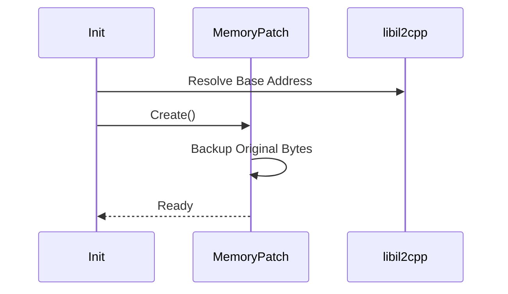
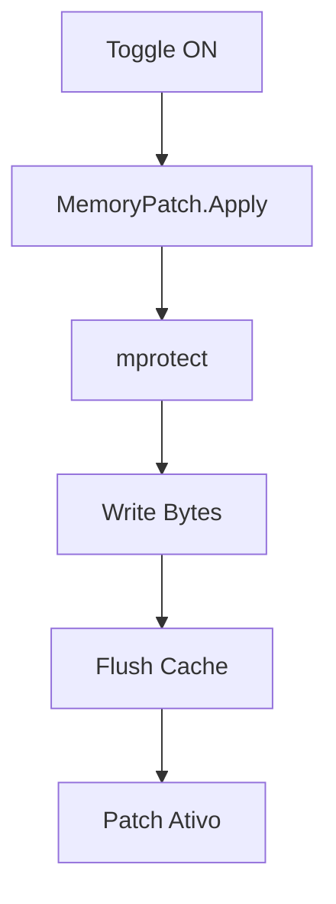
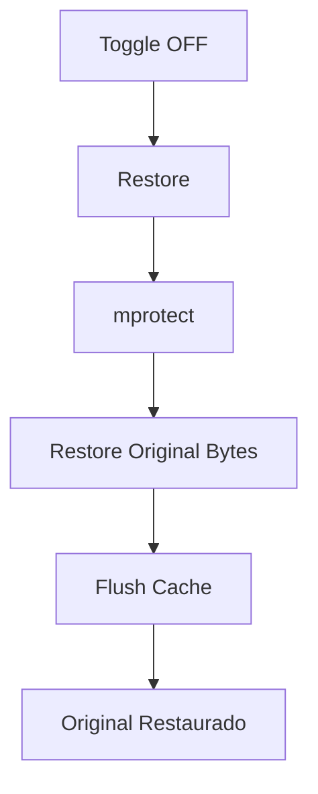
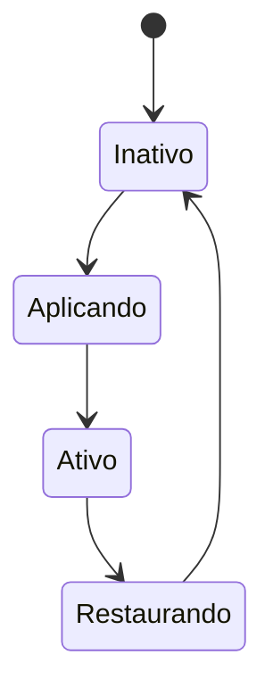
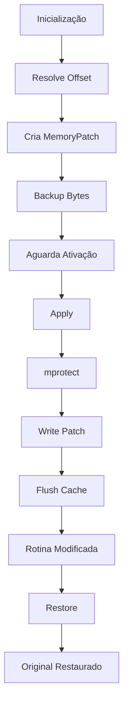

# Energy Patch

> **Arquivo:** `hooks/energy_patch.md`
>
> **Categoria:** Memory Patch
>
> **Tipo:** Runtime Instruction Patch
>
> **Dependências:** `MemoryPatch`, `libil2cpp.so`

***

# Visão Geral

O **Energy Patch** é responsável por modificar diretamente uma rotina da `libil2cpp.so` responsável pelo consumo de energia da aeronave.

Diferentemente dos demais recursos do projeto, este mecanismo **não utiliza Hooking**. Em vez disso, substitui instruções ARM64 em tempo de execução utilizando um sistema de **Memory Patch**, permitindo habilitar e restaurar o comportamento original sempre que necessário.

Essa abordagem foi escolhida porque o objetivo não é interceptar uma função para alterar sua lógica, mas sim impedir que determinadas instruções sejam executadas.

***

# Arquitetura

```mermaid
flowchart LR

A[Feature Toggle]
    --> B[Energy Patch]

B --> C{Ativado?}

C -->|Sim| D[MemoryPatch.Apply()]

C -->|Não| E[MemoryPatch.Restore()]

D --> F[Instruções ARM64 Modificadas]

E --> G[Código Original Restaurado]
```

***

# Objetivo

Eliminar o consumo de energia da aeronave durante o voo.

Na implementação original do jogo existe uma rotina responsável por reduzir continuamente a energia disponível conforme determinadas ações são executadas.

O patch substitui parte dessa rotina por instruções neutras, impedindo que o valor da energia seja decrementado.

***

# Motivo da utilização de Memory Patch

Existem duas possibilidades para alterar esse comportamento:

1. Hook da função
2. Patch das instruções

Neste caso foi escolhido **Memory Patch** pelos seguintes motivos:

- menor overhead
- nenhuma chamada adicional
- nenhuma alteração no fluxo de execução
- menor quantidade de código
- fácil restauração

Como nenhuma decisão precisa ser tomada em tempo de execução, interceptar a função inteira seria desnecessário.

***

# Fluxo de Inicialização

Durante a inicialização do módulo, o sistema cria uma instância de `MemoryPatch`.

Essa instância armazena:

- endereço absoluto
- bytes originais
- bytes modificados



Nesse momento nenhuma modificação é aplicada.

O patch apenas fica preparado para futura utilização.

***

# Ativação

Quando o usuário habilita a opção de energia infinita:

```text
Energy Toggle

↓

MemoryPatch.Apply()

↓

mprotect()

↓

Escreve bytes

↓

Flush Instruction Cache

↓

Patch ativo
```



***

# Processo de Aplicação

A aplicação do patch ocorre em cinco etapas.

## 1. Alteração das permissões

O código da biblioteca está localizado em uma página marcada apenas para leitura.

Antes da escrita é necessário utilizar:

```
mprotect(...)
```

permitindo escrita temporária.

***

## 2. Escrita dos bytes

Os bytes definidos durante a criação do patch são copiados para o endereço alvo.

Esses bytes substituem completamente as instruções originais.

***

## 3. Limpeza do cache de instruções

Após modificar código executável é obrigatório invalidar o cache da CPU.

Sem essa etapa o processador pode continuar executando instruções antigas.

***

## 4. Ativação

Após o flush do cache todas as novas chamadas passam a executar o código modificado.

***

# Desativação

Quando o recurso é desligado:

```text
MemoryPatch.Restore()

↓

mprotect()

↓

Original Bytes

↓

Flush Cache

↓

Código restaurado
```



***

# Estrutura de Estados



***

# Relação com o restante do sistema

O Energy Patch é completamente independente dos hooks.

Ele não depende de:

- ApplyDamage
- RapidFire
- UnitManager
- MissileTrace

Sua única dependência é:

```
MemoryPatch
```

Essa separação reduz acoplamento e facilita manutenção.

***

# Vantagens dessa abordagem

## Baixo Overhead

Após aplicado, nenhuma chamada adicional é executada.

Não existe callback.

Não existe trampoline.

Não existe hook.

A CPU executa diretamente o código modificado.

***

## Simplicidade

Toda a lógica encontra-se encapsulada dentro da classe `MemoryPatch`.

A funcionalidade apenas solicita:

```
Apply()
```

ou

```
Restore()
```

***

## Segurança

Antes de qualquer modificação o sistema preserva os bytes originais.

Isso permite retornar exatamente ao estado anterior sem necessidade de reinicializar o jogo.

***

# Considerações de Performance

A aplicação do patch possui custo apenas durante:

- escrita
- alteração de permissões
- flush do cache

Após concluído, não existe impacto perceptível na execução do jogo.

Comparado com Hooking:

| Método       | Overhead por chamada |
| ------------ | -------------------: |
| Hook         |                  Sim |
| Memory Patch |                  Não |

***

# Fluxo Completo



***

# Resumo Técnico

| Característica           | Valor                |
| ------------------------ | -------------------- |
| Tipo                     | Runtime Memory Patch |
| Interceptação            | Não                  |
| Hook                     | Não                  |
| Trampoline               | Não                  |
| Overhead em Runtime      | Praticamente zero    |
| Reversível               | Sim                  |
| Preserva bytes originais | Sim                  |
| Utiliza mprotect         | Sim                  |
| Flush de cache           | Sim                  |
| Dependência              | MemoryPatch          |

***

# Observações

Este recurso representa o caso ideal para utilização de **Memory Patch**. Como não existe necessidade de executar lógica condicional durante cada chamada da rotina original, a substituição direta das instruções oferece uma implementação mais simples, com menor custo de execução e baixo acoplamento em relação ao restante da arquitetura do projeto.
